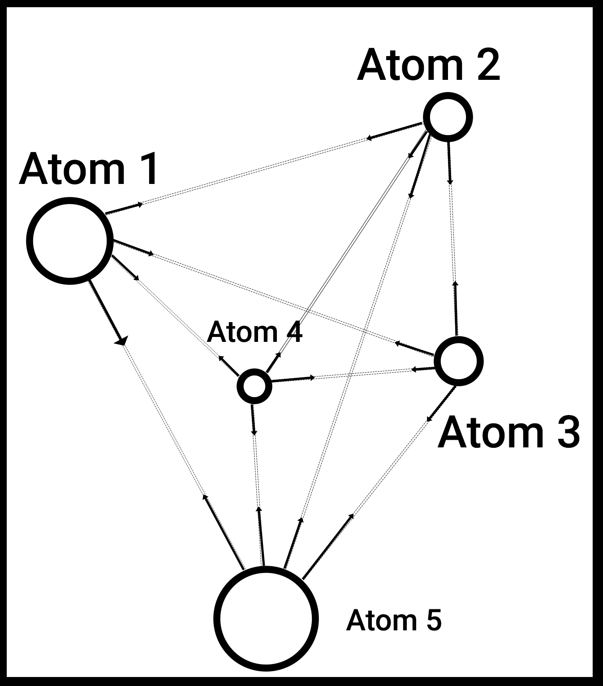
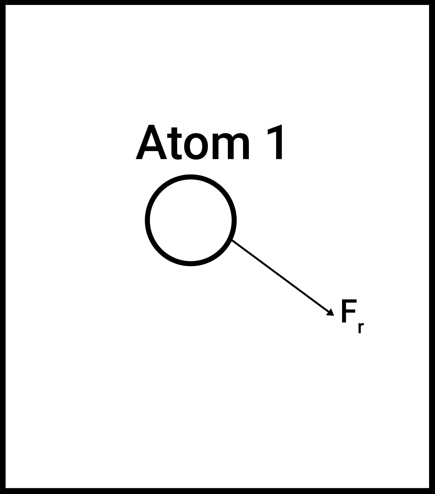
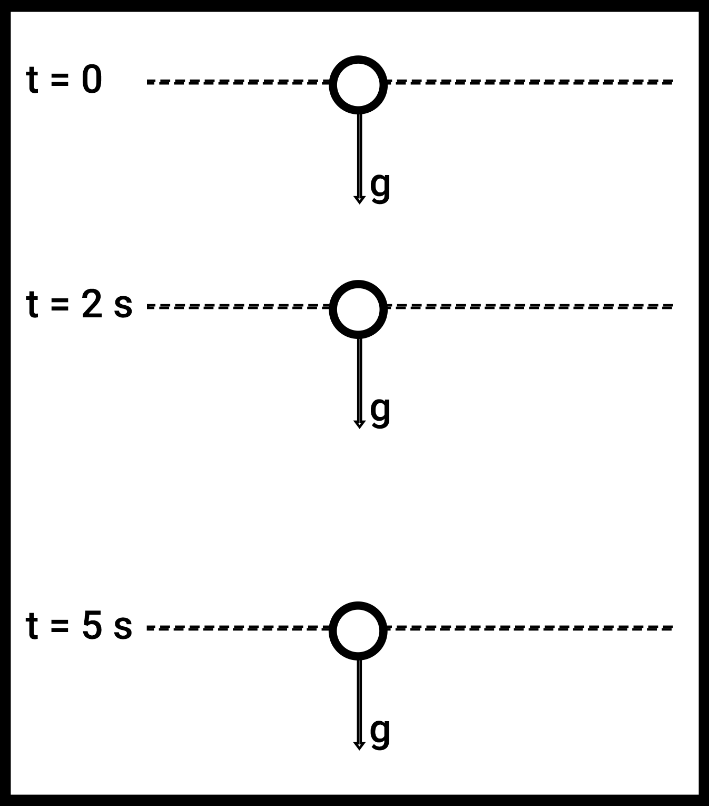
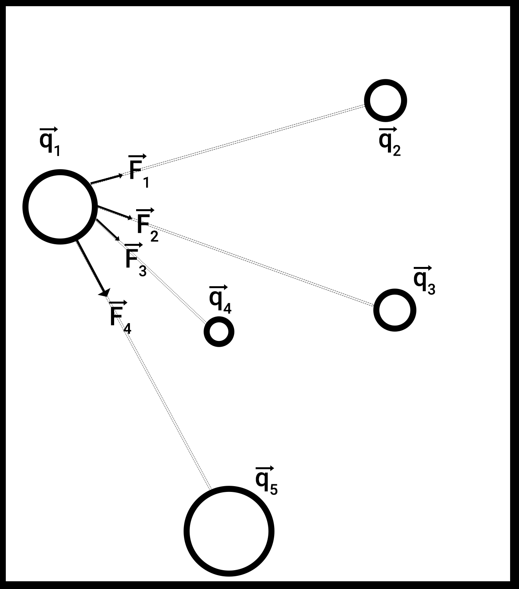

# Dumbing down the complex molecular system

At the end of the day, protein molecules and other different types of molecules are just a set of atoms bunched together, that exert a force on each other. As a result, every atom experiences a resultant force, which causes it to move in a certain direction:

<figure markdown="span">
  { width="300", align=left }
  { width="300", align=left }
</figure>

For the purposes of representation, all attractive forces have been portrayed in the figure on the left, but based on the properties of the atoms, the forces could be repulsive too. The resultant force exerted on atom 1 is shown in the figure on the right, which will determine it's direction of movement.

> If we know the force and the mass of the atom, we can calculate it's acceleration. Why can't we use Newton's second equation of motion to determine where the particle would be positioned at a certain time in the future?

Well, lets take a look at how we CAN solve a physics problem using Newton's second equation of motion:

> Consider a ball falling from a large height. At time t = 0, it is at a height of 1000m, and it has no speed at the given time. What is the height of the ball at t = 10s?

We know that the ball falls at a constant acceleration of $g = 9.8 \frac{m}{s^2}$ in the downward direction. By Newton's second equation of motion, after time $t$:

$$
\begin{align*}
s &= ut + \frac{1}{2}at^2
\end{align*}
$$

Where $s$ = displacement, $u$ is the initial velocity $(= 0)$, and $a$ is the acceleration of the ball. In the equation, we write $a = -g$ to denote that the acceleration is in the downward direction.

$$
\begin{align*}
s &= \frac{1}{2} (-9) (10)^2 \\
&= -450 \\
x_t - x_0 &= -450 \\
x_t - 1000 &= -450 \\
x_t &= 550m
\end{align*}
$$

Simple enough, right? We were able to find out the particle of the ball after 5 seconds. Using the above equation, we can find out the position of the particle *at any time before it hits the ground* by basic substitution.

In order to find out why this can't directly be applied to our molecular system, we have to trace it's roots, and take a closer look at their derivation.

> How do we derive Newton's second equation of motion?

We know that acceleration is the rate of change of velocity. Starting from there:

$$
\begin{align*}
\frac{dv}{dt} &= a 
\end{align*}
$$

Multiplying both sides by $dt$ and integrating both sides from $0$ to $t$,

$$
\begin{align*}
\int_{u}^vdv &= \int_{0}^t a dt 
\end{align*}
$$

Where $u$ denotes initial velocity of the particle and $v$ denotes the velocity of the particle at time $t$.

Derivation of Newton's second equation of motion **assumes that the acceleration of the particle is constant**. In the case of the ball, acceleration of the ball is constant with time - equal to $g$ in the downward direction.

<figure markdown="span">
  { width="300" }
</figure>

But in the case of atomistic interactions, that's not quite true. Let's explore that slightly later. Completing the derivation:

$$
\begin{align*}
v(t) - u &= at \\
v(t) &= u + at
\end{align*}
$$

We know that the velocity at time $t$ is the rate of change of position. Hence, $v(t) = \frac{dy}{dt}$. Here, $y$ denotes the position variable for the particle.

$$
\begin{align*}
\frac{dy}{dt} &= u + at \\
\int_{y_0}^{y_t}dy &= \int_{0}^t (u + at) dt \\
\int_{y_0}^{y_t}dy &= \int_{0}^t u dt + \int_{0}^t at dt \\
y_t - y_0 &= ut + \frac{1}{2} at^2 \\
s &= ut + \frac{1}{2} at^2
\end{align*}
$$

Where $s = y_t - y_0$ denotes the displacement of the particle. This completes the derivation of Newton's second equation of motion, assuming acceleration is constant.

> Does this mean that the acceleration on an atom in a complex molecular system is not constant w.r.t time?

Yes. One of the forces that acts between two atoms is a bonded spring force that depends on the distance between the two. 

<figure markdown="span">
    { width="400" }
</figure>

Consider atom 1 in the above figure, and the interaction between itself and atom 2. The force on the former due to the interaction can be written as follows:

$$
\begin{align*}
\textbf{F}_{b1} &= \frac{1}{2} k_{12} (\textbf{q}_2 - \textbf{q}_1)
\end{align*}
$$

Where $\textbf{F}_{b1}$ is the force on atom 1 solely due to this bonded interaction between atom 1 and 2, $\textbf{q}_1$ is the position vector of atom 1, and $\textbf{q}_2$ is the position vector of atom 2. In 3 dimensions, 

- $\textbf{q}_1 = [q_{1x}, q_{1y}, q_{1z}]$
- $\textbf{q}_2 = [q_{2x}, q_{2y}, q_{2z}]$
- $q_{1x}, q_{1y}, q_{1z}, q_{2x}, q_{2y}, q_{2z}$ are all scalar quantities.
- $k_{12}$ is a spring constant that depends on the properties of the two atoms.

In effect, the Force is a function of the position of the position, which changes with time:

$$
\begin{align*}
\textbf{F}_{b1} &= f(\textbf{q}_1(t)) \\
&= g(t)
\end{align*}
$$

By Newton's second law, the acceleration is also a function of time:

$$
\begin{align*}
\textbf{a}(t) &= \frac{\textbf{F}_{b1}(t)}{m_1}
\end{align*}
$$

Note that the above force calculated is just a result of the bonded force between atom 1 and atom 2, to get the point across. We have many more forces acting on atom 1, but those will be explored later.

Furthermore, the acceleration is not a simple function of time, like $a = c t^2$ that can be easily integrated. The acceleration is a function of time due to it's dependence on it's own position. We're stuck in a loop:

- The position is dependent on the net acceleration of the atom.
- The acceleration of the atom is dependent on the position of the atom.

So how do we integrate this equation, and bargain with Dormammu? Let's take a look at that in the next chapter.
