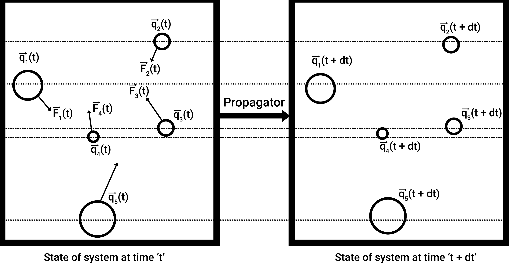
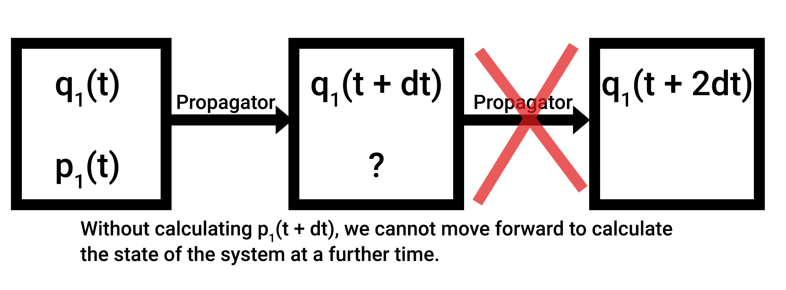
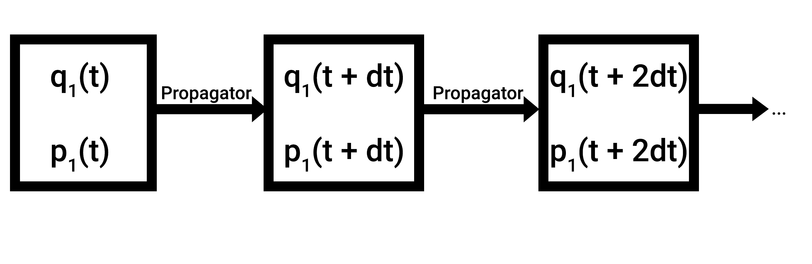

# Integrating our first equation

## Theory

> Let's bring our attention to the problem. The acceleration of the particle depends on its position, and the future position of the particle depends on it's current acceleration. How do we determine what the position of the particle is going to be after some time?

Well, it's quite elementary, my dear Watson. Do you recall the ever-old and wise tools of calculus? The infinitesimal $dt$? Well, that's what we're going to use here.

Let $\textbf{q}_i(t)$ denote the position of the particle at time $t$. At time $t + dt$, let it's position be $\textbf{q}_i(t + dt)$, which we need to find. 

<figure markdown="span">
  
</figure>

The algorithm that obtains the state of the system at time $t+dt$ from time $t$ is called the **propagator**. Rightly so, since it **propagates** the system in time.

Let's take a stock of our differential equations:

$$
\begin{align*}
\frac{d^2\textbf{q}_i}{dt^2} &= \frac{\textbf{F}_{i}(\textbf{q}_{i}(t))}{m_i} \\
\frac{d\textbf{q}_i}{dt} &= \frac{\textbf{p}_i(t)}{m_i}
\end{align*}
$$

- $\frac{d^2\textbf{q}_i}{dt^2}$ is the second derivative of the position of the atom, also known as acceleration.
- The force is a function of position, which in turn is a function of time. For simplicity, we will write $\textbf{F}_i(t)$ going forward.
- The first derivative of position with respect to time is also popularly written as $\dot{\textbf{q}_i}$. Similarly, the second derivative is written with two dots on top of the vector, $\ddot{\textbf{q}_i}$, the third derivative $\dddot{\textbf{q}_i}$, so on and so forth.
- $\textbf{p}_i(t)$ denotes the momentum vector of the particle at time $t$. And $m_i$ denotes the mass of the particle. Momentum over mass is velocity, but in this narrative we will use momentum in the equations of motion and not velocity.

Rewriting the above differential equations,

$$
\begin{align*}
\ddot{\textbf{q}}_i(t) &= \frac{\textbf{F}_{i}(t)}{m_i} \\
\dot{\textbf{q}}_i(t) &= \frac{\textbf{p}_i(t)}{m_i}
\end{align*}
$$

In order to derive $\textbf{q}_i(t + dt)$, we will use the taylor series expansion for it (from [Leach, Molecular Modeling Principles and Applications, equation 7.2](http://inis.jinr.ru/sl/Simulation/Leach%20A.,%20Molecular%20Modelling.%20Principles%20and%20Applications,%202001.pdf)):

$$
\begin{align*}
\textbf{q}_i(t + dt) &= \textbf{q}_{i}(t) + dt\dot{\textbf{q}}_i(t) + \frac{1}{2!}dt^2\ddot{\textbf{q}}_i(t) + \frac{1}{3!}dt^3\dddot{\textbf{q}}_i(t) +  ... \\
\end{align*}
$$

If our timestep is extremely small, we can ignore terms of the order $dt^3$ and so on and so forth.

$$
\begin{align*}
\textbf{q}_i(t + dt) &= \textbf{q}_{i}(t) + dt\dot{\textbf{q}}_i(t) + \frac{1}{2}dt^2\ddot{\textbf{q}}_i(t)
\end{align*}
$$

We know the value of the first and second derivative from our definitions earlier! Let's substitute them in the above equation:

$$
\begin{align*}
\textbf{q}_i(t + dt) &= \textbf{q}_{i}(t) + dt\frac{\textbf{p}_i(t)}{m_i} + \frac{1}{2}dt^2\frac{\textbf{F}_i(t)}{m_i}
\end{align*}
$$

Voila! From what we know about the state of the system at time $t$, we were able to determine the position of the system at time $(t + dt)$! What are the values we needed to calculate it?

- Position of the particle at time $t$,
- Momentum of the particle at time $t$,
- And force of the particle at time $t$. Given the position, in every system there should be a function that maps the force to the position, so this can be easily calculated.

How about calculating $\textbf{q}_i(t + 2dt)$? Can we do that easily? In this manner, I should easily be able to obtain the position of the particle at time $(t + T)$! I just perform this calculation $\frac{T}{dt}$ times!

Let's take a look. In order to calculate $\textbf{q}_i(t + 2dt)$,

$$
\begin{align*}
\textbf{q}_i(t + 2dt) &= \textbf{q}_{i}(t + dt) + dt\frac{\textbf{p}_i(t + dt)}{m_i} + \frac{1}{2}dt^2\frac{\textbf{F}_i(t + dt)}{m_i}
\end{align*}
$$

- Do we have the first term? Yes, we just calculated that.
- Do we have the force? Yes! Given the new position at time $(t + dt)$, we can obtain the new force for the system.
- Do we have $\textbf{p}_i(t + dt)$? Not quite. The momentum of the system doesn't remain the same. Why not? Since the particle accelerates! Simple. If there was no acceleration on the particle, then the momentum would have remained constant.

<figure markdown="span">
  
</figure>

So, in order to calculate $\textbf{q}_i(t + 2dt)$, I first need to obtain $\textbf{p}_i(t + dt)$. Let's explore how to do that. Using the same taylor series expansion, but for momentum, we have:

$$
\begin{align*}
\textbf{p}_i(t + dt) &= \textbf{p}_{i}(t) + dt\dot{\textbf{p}}_i(t) + \frac{1}{2}dt^2\ddot{\textbf{p}}_i(t)
\end{align*}
$$

By Newton's second law, the rate of change of momentum w.r.t time is equal to the force on the particle (from [An Introduction to Mechanics, equation 4.1](https://books.google.com/books?id=Hmqvhu7s4foC))!

$$
\begin{align*}
\textbf{p}_i(t + dt) &= \textbf{p}_{i}(t) + dt\textbf{F}_i(t) + \frac{1}{2}dt^2\ddot{\textbf{p}}_i(t)
\end{align*}
$$

> Now, how do we calculate $dt^2\ddot{\textbf{p}}_i(t)$? 

Well, it's simple, we use the Taylor Series expansion again, but on $\dot{\textbf{p}}_i(t)$! (I know  this is all crazy math, you're probably checked out by now. But I swear we're almost done).

$$
\begin{align*}
\dot{\textbf{p}}_i(t + dt) &= \dot{\textbf{p}}_{i}(t) + dt\ddot{\textbf{p}}_i(t) + \frac{1}{2}dt^2\dddot{\textbf{p}}_i(t)
\end{align*}
$$

Since we want $dt^2\ddot{\textbf{p}}_i(t)$, we multiply both sides by $dt$.

$$
\begin{align*}
dt\dot{\textbf{p}}_i(t + dt) &= dt\dot{\textbf{p}}_{i}(t) + dt^2\ddot{\textbf{p}}_i(t) + \frac{1}{2}dt^3\dddot{\textbf{p}}_i(t)
\end{align*}
$$

Since $dt^3$ terms are too small in comparison to $dt$ and $dt^2$, we can consider them to be close to 0.

$$
\begin{align*}
dt\dot{\textbf{p}}_i(t + dt) &= dt\dot{\textbf{p}}_{i}(t) + dt^2\ddot{\textbf{p}}_i(t)
\end{align*}
$$

As we know, from Newton's second law (goddamn, can we not talk about him for once?), $\dot{\textbf{p}}_i = \textbf{F}_i$.

$$
\begin{align*}
dt\textbf{F}_i(t + dt) &= dt\textbf{F}_{i}(t) + dt^2\ddot{\textbf{p}}_i(t) \\
dt^2\ddot{\textbf{p}}_i(t) &= dt\textbf{F}_{i}(t + dt) - dt\textbf{F}_i(t)
\end{align*}
$$

Done. Now we just need to substitute it back into, ... wait, which equation was it?

$$
\begin{align*}
\textbf{p}_i(t + dt) &= \textbf{p}_{i}(t) + dt\textbf{F}_i(t) + \frac{1}{2}dt^2\ddot{\textbf{p}}_i(t)
\end{align*}
$$

Aah right, it's this one.

$$
\begin{align*}
\textbf{p}_i(t + dt) &= \textbf{p}_{i}(t) + dt\textbf{F}_i(t) + \frac{1}{2}[dt\textbf{F}_{i}(t + dt) - dt\textbf{F}_i(t)] \\
&= \textbf{p}_{i}(t) + \frac{1}{2} dt [\textbf{F}_{i}(t + dt) + \textbf{F}_i(t)]
\end{align*}
$$

- Do we have $\textbf{F}_i(t)$? Yes, we do!
- Do we have $\textbf{F}_{i}(t + dt)$? Well, we obtained the position at the new timestep. We can plug the new position into the force function, and obtain $\textbf{F}_{i}(t + dt)$. So yes, we do!

FINALLY! We have what we need. This propagator algorithm is popularly called the **velocity-verlet** algorithm.

----

## Summary

- We understood what a propagator algorithm is.
- We derived a popular propagator algorithm, called the velocity verlet algorithm.
    - In summary, if you are given the position and momentum of a particle at time $t$, and a force function that maps the position to the force on the particle, you can obtain the position and momentum of the particle at time $(t + dt)$.

<figure markdown="span">
  
</figure>

- Let's summarize the steps:
    - You are given $\textbf{q}_i(t)$, the position of the particle at $t$.
    - You are given $\textbf{p}_i(t)$, the momentum of the particle at $t$.
    - Using $\textbf{F}_i(\textbf{q}_i)$, you calculate the force on the particle at that time.
    - The mass of the particle is given too, as $m_i$.
    - Assume a small number for $dt$. Take $dt = 0.001$.
    - Using $\textbf{q}_i(t + dt) = \textbf{q}_{i}(t) + dt\frac{\textbf{p}_i(t)}{m_i} + \frac{1}{2}dt^2\frac{\textbf{F}_i(t)}{m_i}$, calculate the position of the particle at time $(t + dt)$.
    - Calculate the force on the system at time $(t + dt)$, by inputting the newly obtained position vector into the force function.
    - Using $\textbf{p}_i(t + dt) = \textbf{p}_{i}(t) + \frac{1}{2} dt [\textbf{F}_{i}(t + dt) + \textbf{F}_i(t)]$, we can calculate the momentum of the system at time $(t + dt)$.

