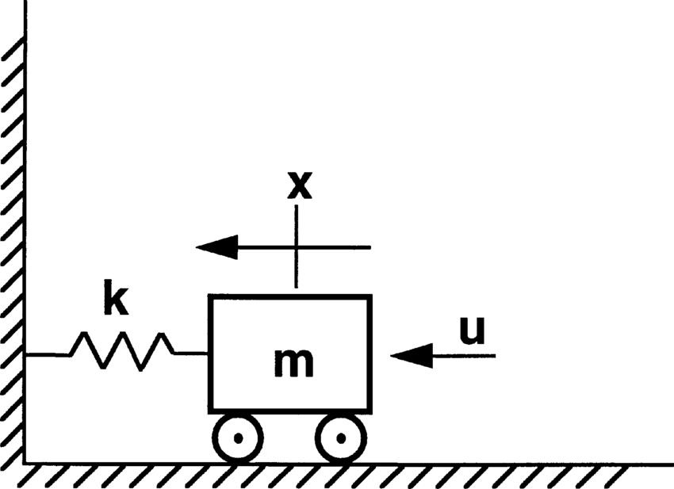
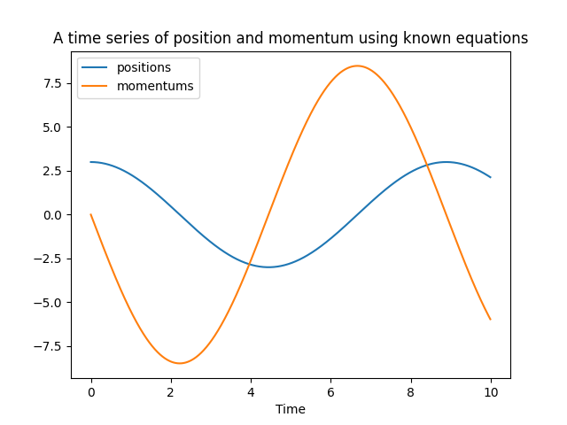
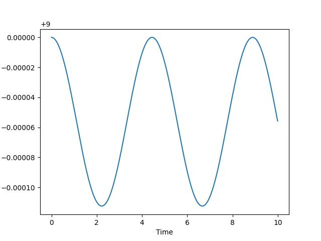

# Writing our first simulation in python

> Okay, I have understood why we need MD simulations, and how to perform them. Can we get some hands-on practice now? 

Yes, of course! Let's get our hands dirty with some simulation code written in python.

We shall use an example of the classical harmonic oscillator system - A single particle attached to a spring in one dimension:

<figure markdown="span">
  {width="300"}
</figure>

In the above image, $x$ is used to denote the position, but we will use $q$ to denote the same throughout this blog. $k$ denotes the spring constant, and it's value is determined by the properties of the spring.

The force on the particle is directly proportional to the position of the particle from the origin:

$$
\begin{align*}
F(q) &= -kq
\end{align*}
$$


Here q denotes the position of the particle. If the position is positive, then the force is negative. Similarly, if the position is negative, then the force is positive. Either ways, the force on the particle always tries to drag it back to the origin.

A similar detail to note here, is that although the force is a vector, I have used scalar notation in this context ($F(q)$), since it's a one particle system in a single dimension. So the vector is essentially a single element vector, and we use scalar notation to denote the same.

The differential equations then become:

$$
\begin{align*}
\ddot{q} &= \frac{F(q)}{m_i} \\
&= \frac{-kq}{m_i} \\
\dot{q} &= \frac{p}{m}
\end{align*}
$$

Where $m$ is the mass of the particle.

Some of you may be wondering... We already know the solution to this system. Yes, that is absolutely correct. That makes this system an extremely good one to test on! We'll see that later.


```python
import numpy as np
import matplotlib.pyplot as plt

class SpringSystem:

    def __init__(self, k, m):
        self.k = k
        self.m = m
    
    def force(self, q):
        return -self.k * q
```

When there is a force being exerted by the spring, there is an inherent potential energy - $U(q)$ - associated with it. The negative of the derivative of the potential energy w.r.t. the position is equal to the force:

$$
\begin{align*}
\frac{-\partial U}{\partial q} &= F(q) \\
&= -k q \\
\partial U &= kq \partial q
\end{align*}
$$

Integrating both sides,

$$
\begin{align*}
U(q) &= \frac{1}{2} kq^2
\end{align*}
$$

Let's add this potential energy function to our spring system:

```python
class SpringSystem:

    def __init__(self, k, m):
        self.k = k
        self.m = m
    
    def force(self, q):
        return -self.k * q

    def potential(self, q):
        return 0.5 * self.k * q**2
```

In order to perform our first simulation, we need an initial position and momentum.
Let us use the following parameters for our first simulation:


```python
q0 = 3 # Initial position 
p0 = 0 # Initial momentum
sys = SpringSystem(2, 4) # Spring system with k = 2 and m = 4
dt = 0.001 # Timestep of the simulation
nsteps = 100 # Number of timesteps of the simulation
```

Let's write the velocity verlet algorithm. Here are the equations we derived in the last chapter:

$$
\begin{align*}
\textbf{q}_i(t + dt) &= \textbf{q}_{i}(t) + dt\frac{\textbf{p}_i(t)}{m_i} + \frac{1}{2}dt^2\frac{\textbf{F}_i(t)}{m_i} \\
\textbf{p}_i(t + dt) &= \textbf{p}_{i}(t) + \frac{1}{2} dt [\textbf{F}_{i}(t + dt) + \textbf{F}_i(t)]
\end{align*}
$$

```python

def propagator(q, p, F, m, dt):
    """
    q -> scalar number of position
    p -> scalar number of momentum
    F -> the force function which takes as input the position of the system and returns the force value
    m -> scalar value denoting the mass of the particle
    dt -> the timestep of the system
    """
    force_old = F(q)
    q = q + dt * p / m + 0.5 * dt**2 * force_old / m
    force_new = F(q)
    p = p + 0.5 * dt * (force_old + force_new)
    return q, p
```

We have all the tools we need! Let's get started.
We will run the propagator for $nsteps$ iterations. Each iteration propagtes the system $dt$ forward in time.

```python
q = x0
p = p0

positions = []
momentums = []
times = []

for i in range(nsteps):
    t = dt * i
    positions.append(q)
    momentums.append(p)
    times.append(t)
    q, p = propagator(q, p, sys.force, sys.m, dt)

positions = np.array(positions)
momentums = np.array(momentums)
times = np.array(times)
```

Let's plot the positions and momentums with time:

```python
plt.plot(times, positions, label = 'positions')
plt.plot(times, momentums, label = 'momentums')

plt.legend(loc = 'best')
plt.xlabel('Time')

plt.title('A time series of position and momentum by simulation')
```

<figure markdown="span">
  {width="1000"}
</figure>


By all mathematical standards and derivations we did in the last chapter, this should be correct, right? Lucky for us, there is an alternate method to check! The solution to this system is known:

$$
\begin{align*}
q(t) &= A sin(\omega t + \phi)
\end{align*}
$$

Where:

- A is the amplitude of the system. The amplitude is equal to the position of the system when momentum is equal to 0. So, in this case, $A = 3$.
- $\omega = \sqrt{\frac{k}{m}}$ is the angular frequency. $\omega = \sqrt{\frac{2}{4}} = \sqrt{0.5} = 0.707$.
- $\phi$ is the phase angle. We can find that out because we know that $q(0) = A$, so $sin(\phi) = 1$. Hence, $\phi = \frac{\pi}{2}$, and $q(t) = A cos(\omega t)$.
- Hence $q(t) = 3 cos(0.707t)$.
- $p(t) = m\dot{q} = 4 * 3 * 0.707 * -sin(0.707 t) = -8.484sin(0.707t)$

Let's plot this in python:

```python


position_known = 3 * np.cos(0.707 * times)
momentum_known = -8.484 * np.sin(0.707 * times)

plt.plot(times, position_known, label = 'positions')
plt.plot(times, momentum_known, label = 'momentums')

plt.legend(loc = 'best')
plt.xlabel('Time')

plt.title('A time series of position and momentum using known equations')
```

<figure markdown="span">
  {width="1000"}
</figure>

Yes, the graphs are the same!
By this method, we have verified that the velocity-verlet algorithm does work for simulations!
There's another property of this simulation.
The total energy of the system is the sum of the kinetic energy of the particle and potential energy of the spring:

$$
\begin{align*}
Total \: energy &= U(q) + K(p)
\end{align*}
$$

In the above equation, we know that the potential energy of the particle only depends on the position, and the kinetic energy only on the momentum. You could have more complex systems, but in most MD simulation systems this would be the dependence between the energy values.

$$
\begin{align*}
Total \: energy &= \frac{1}{2}kq^2 + \frac{1}{2}\frac{p^2}{m}
\end{align*}
$$

Let's calculate this value for our simulation as a function of time:

```python

total_energy = 0.5 * sys.k * positions**2 + 0.5 * momentums**2 / sys.m


plt.plot(times, total_energy)

plt.xlabel('Time')
plt.ylabel('Total energy')
```

<figure markdown="span">
  {width="1000"}
</figure>

The above graph just means that the total energy is around 9, with fluctuations of $ \pm 0.000010$. In essence, we can say that the total energy of the system remained constant throughout time. This simulation is called as an **NVE** simulation, and the points are said to be sampled from the **microcanonical ensemble**. What does this mean? Let's take a look at that in the next chapter!